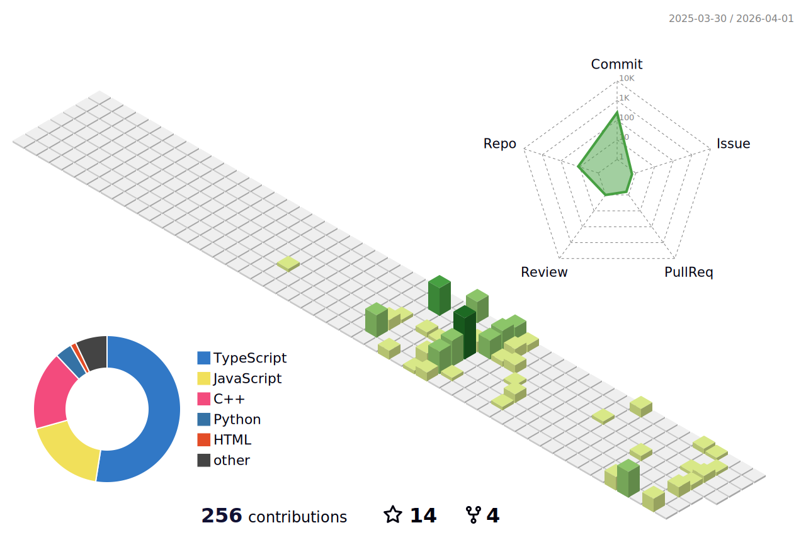

<h1 align="center">
  <b>Hi , I'm Himanshu Raj</b>
</h1>

  

  

  

  

<h3 align="left">🚀 About Me</h3>

  Main ek student hoon jo filhaal <b>IIT Roorkee ke iHUB Divya Sampark</b> se Product Management & Applied AI seekh raha hoon. Mera passion technology aur strategy ke intersection par innovative products build karna hai.
    
  - 🔭 I’m currently working on: <b>Finishing 2 major projects: ek Product Case Study aur ek AI POC (Proof of Concept).</b>
   
  - 🌱 I’m currently learning: <b>Python, JavaScript, aur SQL</b> to build a strong technical base.
   
  - 🎯 My 2026 Goal: To crack <b>CUET 2026</b> and pursue a <b>BCA</b>.
   
  - 🚀 My Career Vision: To become an impactful <b>Product Manager</b> and lead teams after an <b>MBA</b>.
   
  - 📫 How to reach me: <a href="mailto:contacthimanshu222@gmail.com"><b>contacthimanshu222@gmail.com</b></a>

<h3 align="left">🌌 My Skill Matrix</h3>

  

<h3 align="left">🛰️ Connect with me:</h3>

  
  

<h3 align="left">📜 My Certifications</h3>
<ul>
  <li><b>Generative AI Mastermind</b> (Outskill)</li>
  <li><b>Future-Ready Product Management with Applied AI</b></li>
  <li><b>OpenAI ChatGPT: Creating Custom GPTs</b></li>
  <li><b>Copilot in Teams: AI-Powered Collaboration</b></li>
  <li><b>Leveraging the Power of Social Intelligence in the Age of AI</b></li>
</ul>

<h3 align="left">✨ My GitHub Stats:</h3>

  
    
  

  

