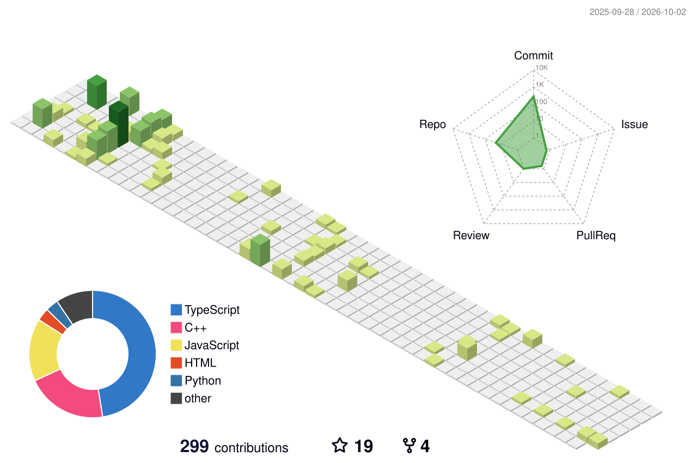

  <!-- SMOOTH 3D CONTINUOUS ANIMATION (GIF/WEBP) -->
  <!-- Replace this link with your own 60fps 3D Blender/DaVinci render -->
  

    

  <h1 align="center">HIMANSHU RAJ</h1>
  

    <b>AI Product Builder | WebGPU Architect | BCA @ LPU</b>
  

  <!-- Profile Views Counter -->
  

    
    
  

---

### 🚀 Core Focus: [HR-AI-MIND](https://www.linkedin.com/feed/update/urn:li:activity:7394383516546908160/)
**100% Offline-first, WebGPU-powered AI chat assistant.** No servers, zero cloud telemetry. Runs local LLMs (Llama 3.2 & Phi 3.5 Mini) directly inside browser RAM. 
- **Tech Stack:** React, TypeScript, Tailwind, WebGPU, WebLLM, Dexie.js
- **Features:** Native Voice (TTS+STT), Multi-session context, Virtualized rendering.
- 🔗 **[Live Demo](https://www.linkedin.com/safety/go/?url=https%3A%2F%2Fai%2Ehraimind%2Ein%2F&urlhash=39WR&mt=ICYQRxOdzQ5zftjaD7NgPw3e48o4CN1ys3x_Y-VckM4DPDdevFdHtJ-lp4rxAToSIKHoZSp6ov6XVl4vAFp0meJvZXLF&isSdui=true)** | 💻 **[Source Code](https://www.linkedin.com/feed/update/urn:li:activity:7394383516546908160/)**

---

### 📊 Tech Stack & Language Working Graph

  
  <!-- GitHub Top Languages Graph -->
  
  
  <!-- GitHub Overall Stats -->
  

 

  

---

### 🧊 3D Contribution & Activity Animations

  <!-- Your Custom 3D Isometric Git Activity Graph -->
  

    

  <!-- Your Custom Ocean Snake Game Animation -->
  

---

### 🏆 Credentials & Milestones

*   **Product Management with Applied AI (Certificate of Excellence)** — *iHUB DivyaSampark @ IIT Roorkee*
*   **NASA Open Science 101 & Essentials** — *NASA Science Mission Directorate*
*   **Rapid Prototyping (36H Hackathons)** — *Code Flux 2026 & DevStorm 2026*
